### 👋 Hi there, I'm Shantanu

I am a DevOps professional with over 6.5 years of experience in system administration, incident management, and cloud infrastructure automation. After managing and monitoring enterprise-scale environments at FIS Global, I specialize in architecting secure, automated CI/CD pipelines and scalable infrastructure.

### 🛠️ Tech Stack & Tools

**Cloud & Infrastructure:**  
    

**CI/CD & Delivery:**  
   

**Monitoring & Observability:**  
 

**Scripting:**  
  

### 🏆 Certifications

### 🚀 Featured Projects

- [Enterprise DevSecOps Pipeline](https://github.com/ssarode1410/tf-security-lab): Immutable AWS infrastructure deployed via Terraform and GitHub Actions with integrated Checkov security scanning.
- [Example Voting App](https://github.com/ssarode1410/example-voting-app): A multi-tier distributed application demonstrating containerization and orchestration.
- [Azure DevOps Sample Web App](https://github.com/ssarode1410/Azure-DevOps-Sample-Web-App): End-to-end CI/CD pipeline for a sample web application using Azure DevOps.

### 📫 Let's Connect

 

  
  

  

